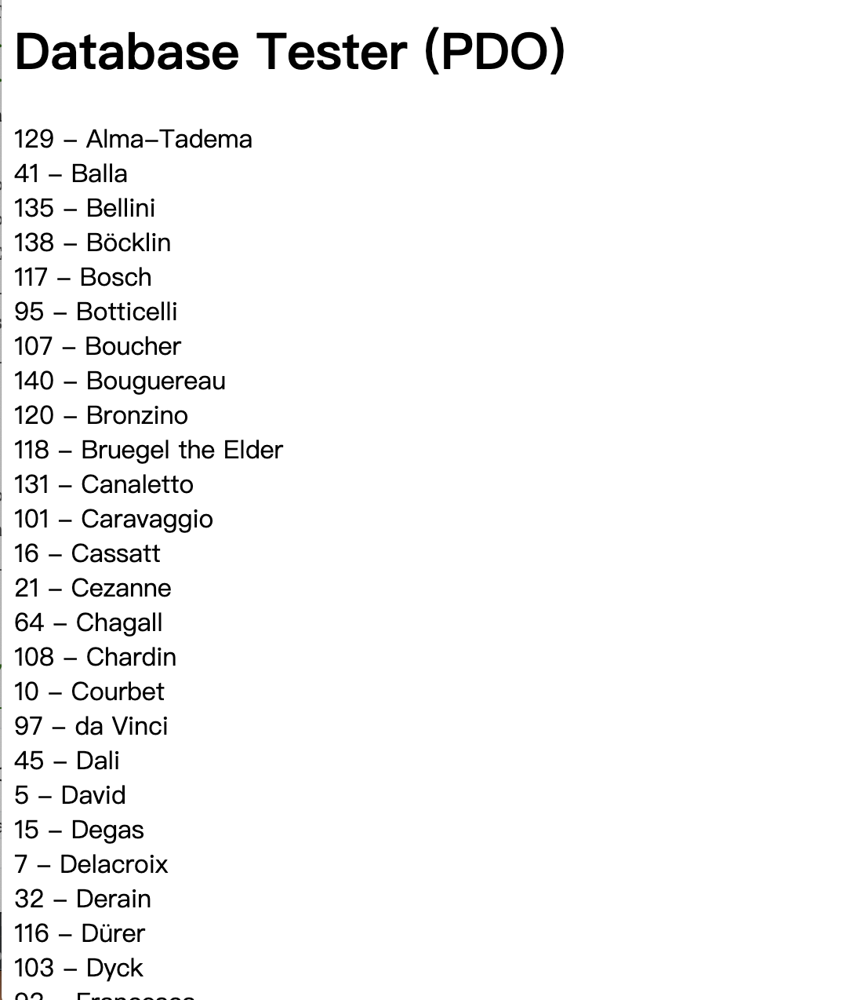
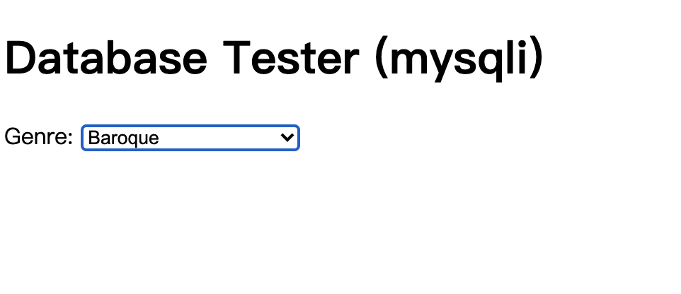

## exercise 7 ##

* pdo

>  $pdo = new PDO(DBCONNSTRING,DBUSER,DBPASS); 

new一个新的php数据对象（连接数据库） ，赋给pdo这个变量

>  $pdo->setAttribute(PDO::ATTR_ERRMODE, PDO::ERRMODE_EXCEPTION);

 setAttribute — 设置属性 ,ATTR_ERRMODE：错误报告,ERRMODE_EXCEPTION: 抛出 exceptions 异常。 

> $sql = "select * from Artists order by LastName";

确定一下搜索的那个输入（前面的exercise那个sql里面输入的内容

> $result = $pdo->query($sql);

result是pdo关于前面得到的sql的查询

>  while ($row = $result->fetch()) {
>          echo $row['ArtistID'] . " - " . $row['LastName'] . "<br/>";
>      }
>      $pdo = null;

 进入循环，获得数据行，输出内容。
 最后释放资源，关闭数据库连接。

(php里"->''是对象的function或者属性)



* mysqli

```php
<?php require_once('config.php'); ?>
```

调用一次config.php 

>  $connection = mysqli_connect(DBHOST, DBUSER, DBPASS, DBNAME);

mysqli函数，连接到MySQL服务器，获得数据库资源。

> if ( mysqli_connect_errno() ) {
>              die( mysqli_connect_error() );
>          }

如果连接出现了错误，就返回一个关于错误的描述

> $sql = "select * from Genres order by GenreName";

设置所执行的查询语句（就类似前几个练习的ui里面sql输入的

> if ($result = mysqli_query($connection, $sql)) {
>            // loop through the data
>            while($row = mysqli_fetch_assoc($result)) {
>                echo '<option value="' . $row['GenreID'] . '">';
>                echo $row['GenreName'];
>                echo "</option>";
>            }
>            // release the memory used by the result set
>            mysqli_free_result($result);
>        }

如果查询成功，进入循环，mysqli_fetch_assoc()返回代表读取行的关联数组。如果结果集中没有更多的行则返回 NULL。输出option 标签及其内容。循环结束后，释放结果集。

> mysqli_close($connection);

断开和数据库连接



## exercise 8


和上一个练习一样，调用一次config.php

+ outputArtists()
  通过PDO连接Artists数据库，获得30行数据

  在循环中将每一行的LastName在a标签中输出，并设置a标签的各项属性，通过if判断改变其class属性。

  最后断开和数据库的连接。

+ outputPaintings()
  同样通过PDO连接Paintings数据库，通过点击获得的id定位得到数据，进入循环，执行outputSinglePainting方法，最后释放资源，断开数据库连接。

+ outputSinglePainting($row)
  此方法通过获得的$row，定位url输出照片，标题以及介绍，

## exercise9 ##

+ ResultSet  executeQuery（String sql）throws SQLException：专用于查询。
+ int  executeUpdate（String sql）throws SQLException：执行DDL、DML语句，前者返回0，后者返回受影响行数。
+ boolean execute（String sql）throws SQLException：可执行任何SQL 语句。如果执行后第一个结果为ResultSet（即执行了查询语句），则返回true；如果执行了DDL、DML语句，则返回false。返回结果为true，则随后可通过该Statement对象的getResultSet()方法获取结果集对象（ResultSet类型），返回结果为false，则可通过Statement对象的getUpdateCount（）方法获得受影响的行数。
  ####PreparedStatement
+ PreparedStatement预编译SQL语句，性能更好，执行更快。
+ PreparedStatement无须“拼接”SQL 语句，编程更简单。
+ PreparedStatement可以防止SQL 注入（如将输入的true当成直接量，导致判断直接通过，从而降低了安全性），安全性更好。

图片和上一张应该是一样的

## ex10 ##

来不及了 

